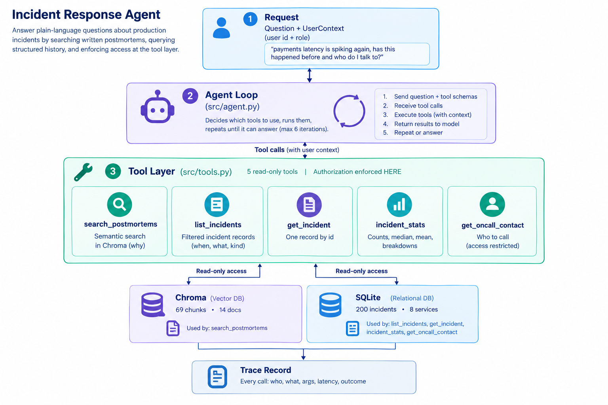

# Incident Response Agent

**An agent that answers real questions about production incidents. The interesting part is everything around the model.**

---

Spinning up an agent is a weekend. A model, a handful of tools, a loop that runs until the model stops asking for things it works, and it is genuinely impressive the first time it chains two tools together on its own.

Then you point it at data that matters, and the real questions start. Can it reach records this particular user shouldn't see? When it answers wrong, can you tell whether it retrieved badly or reasoned badly? What happens when a contractor asks the same question an engineer just asked?

None of those are model problems. They're harness problems like retrieval, tool design, authorization, and tracing. That's where the engineering actually is, and it's the part that gets skipped in most agent tutorials.

This repo is a complete, runnable example of that harness. It happens to answer questions about production incidents; the incident domain is just a vehicle. Everything here moves to any domain where an agent touches data that isn't all public.

> **The longer argument**  why the model is the least interesting component, and what broke along the way   is written up here: [**The agent was the easy part**](#MEDIUM_LINK). This README is the implementation: what the code does and why it's shaped this way.

## Who this is for

- **You've built an agent demo and now need it to be real.** The gap between "it answered my question" and "I'd let someone else run this" is mostly in sections 3 and 5 below.
- **You're evaluating RAG against a direct query.** Section 2 is a worked example of when retrieval is the wrong tool.
- **You care about agent authorization.** Section 3 argues that per-agent allow-lists are necessary and not sufficient, and shows the alternative running.
- **You want something to break.** Everything runs locally on synthetic data. Clone it, change the role flag, and watch the trace.

Requirements: Python, SQLite, Chroma, and one Anthropic API key.

---

## Architecture

<!-- SCREENSHOT 1 architecture diagram (Excalidraw PNG) goes here, docs/images/architecture.png -->


Five pieces, and only one of them is the model.

A **question** arrives with a **user context** who is asking and what role they hold. That context comes from the caller, never from the model, and the model never sees it.

The **loop** sends the question and the tool schemas to the model, gets back either a tool call or a final answer, executes the call, appends the result, and goes again. It's about 25 lines and it is the least interesting file in the repo.

The **tool layer** is where authorization is enforced. Five tools, each one checking the user context before it touches data. A refusal here is an exception, not an empty result.

Two **data stores** sit behind the tools: a SQLite database of 200 incident records, and a Chroma vector store of 69 chunks drawn from 14 postmortem documents. Structured facts in one, written narrative in the other.

Underneath everything, a **trace** records every tool call who, what arguments, outcome, duration, and a one-line summary of what came back.

---

## How a question actually flows

Rather than list features, here is one real question end to end, with the decision that mattered at each step.

**The question:** *"We're seeing payment timeouts again. Has this happened before, and who should I call?"*

### Step 1 The model gets a plan, not an answer

The model receives the question plus five tool schemas. It has no data yet. It decides, on its own, that this needs semantic search across written documents *and* a structured query *and* a contact lookup.

> **The general problem:** an agent's first decision is which tools to use, and it makes that decision from tool *descriptions* alone. Descriptions are not commentary. They are the only interface the model has, and they are read literally. More on this in section 2.

### Step 2 Retrieval over documents

`search_postmortems("payment timeouts connection pool")` hits the vector store and returns chunks from several postmortems written months apart. The useful detail is buried in Root Cause and Timeline sections not in titles or summaries.

> **The general problem:** this only works if the chunking was right. Retrieval quality is set at ingestion time, not query time. Section 1.

### Step 3 Structured query for what retrieval can't do

The documents can't answer "how many" or "how long". `list_incidents(service="payments")` goes to SQLite and returns the full set with dates and durations.

> **The general problem:** RAG is not a database. Counting, filtering, and aggregating over records are query operations, and dressing them up as semantic search makes them slower and less correct. Give the agent both and let it choose.

### Step 4 The contact lookup, and the authorization check

`get_oncall_contact("payments")` is the one tool that returns personal data. It checks the user context before reading anything.

Run as an engineer, it returns the contact. Run as a contractor, it raises `AccessDenied`, the trace records a refusal, and the agent reports plainly that it couldn't retrieve the contact without inventing one.

> **The general problem:** the prompt is not a security boundary. You cannot ask a model nicely to keep a secret. Section 3.

### Step 5 The answer, and the record of how it got there

The model composes a reply from three tool results. The trace shows all three calls, in order, with arguments and outcomes.

```
Q [p.zinzuvadia / engineer]: We're seeing payment timeouts again. Has this happened before, and who should I call?

Yes — this is a recurring failure mode in payments, not a new problem.

- INC-0020 (Nov 14, 2025) — connection pool sized for traffic from 18 months prior, couldn't handle morning peak.
- INC-0076 (Jan 29, 2026) — p99 degraded to 6s, same failure mode.
- INC-0100 (Mar 18, 2026, Sev-1) — ~4,100 checkouts failed. Third occurrence of the same mode.
- INC-0144 (Jun 3, 2026) — driver bump changed idle timeout defaults.
- INC-0187 (Aug 21, 2026) — request queueing under sustained traffic.

[...]

Who to call: Payments Platform — Dana Whitfield, +1-415-555-0142

==============================================================================
TRACE
==============================================================================
#   TOOL                 USER         OUTCOME        MS  ARGUMENTS
------------------------------------------------------------------
1   search_postmortems   p.zinzuvadia ok          363.6  query='payment timeouts', service='payments'
    └─ 10 chunk(s) from 4 postmortem(s)
2   list_incidents       p.zinzuvadia ok            3.7  service='payments'
    └─ 48 incident(s)
3   get_oncall_contact   p.zinzuvadia ok            0.1  service='payments'
    └─ Payments Platform / Dana Whitfield
------------------------------------------------------------------
3 tool call(s), 367.4 ms total in tools
```
Two things worth noticing. It found the full five incident cluster spanning ten months, and none of those five mention "connection pool" in their title or summary that's the chunking from section 1 paying off.

And retrieval only returned chunks from **four** postmortems, not five. The fifth incident reached the answer through `list_incidents`, not through search. That's the argument for giving an agent both a retrieval tool and a query tool: retrieval doesn't have to be perfect if there's another path to the fact.

> **The general problem:** "the service is up" and "the agent behaved correctly" are different claims, and standard monitoring only gives you the first. Section 4.

---

## The data

Both stores are generated from one seeded script, so the demo is identical on every machine.

**Structured** 200 incidents across 8 services over 12 months, in SQLite. 16 Sev-1, 46 Sev-2, 138 Sev-3. Each row carries service, severity, timestamps, resolution minutes, and on-call contact fields.

**Unstructured** 14 markdown postmortems with the sections a real one has: Summary, Timeline, Root Cause, Resolution, Follow-ups.

One deliberate design choice: **the contact fields live in the same table as everything else.** They are not hidden in a separate store that the agent simply has no connection string for. Hiding data by not wiring it up is not access control it's luck, and it stops being true the moment someone adds a convenient join. The point of this repo is to enforce the rule at the boundary where the data is read.

The corpus also has a planted structure worth knowing about before you run it: a connection-pool exhaustion problem recurs across five payments incidents over ten months, escalating from Sev-3 to Sev-1, with a deferred follow-up that goes unfixed through three of them. **None of the five mention "connection pool" in their title or summary.** That's the retrieval test. A second service hits the same failure later and notes that the payments writeups would have saved them time which is the whole argument for the tool in one line.

```bash
python generate_data.py     # deterministic; SEED=20261005
```

---

## 1. Retrieval quality is decided at ingestion, not at query time

The instinct when retrieval underperforms is to tune the query, raise `top_k`, or swap the embedding model. Usually the damage was done earlier.

Three decisions in `src/ingest.py` do most of the work:

**Chunk on semantic boundaries, not character counts.** Postmortems have sections. A fixed 500-character window splits a root cause across two chunks and staples half of it to an unrelated timeline entry. Chunking by markdown section means every chunk is a complete thought.

**Prepend context to every chunk.** An embedded chunk that reads *"The pool was exhausted within four minutes of peak"* is nearly useless on its own it doesn't say which service, which incident, or when. Each chunk gets a header naming the incident, service, date, and section before it's embedded.

**Drop what will never be retrieved.** Follow-up sections are mostly ticket IDs and owner names. They embed badly, they match noisily, and nobody asks questions they answer.

```python
# src/ingest.py context travels with the chunk, into the embedding
chunk_text = (
    f"Incident {incident_id} | {service} | {date} | Section: {section}\n\n"
    f"{body}"
)
```

14 documents → **69 chunks**. You can inspect retrieval without spending a single model token:

```bash
python src/check_retrieval.py
```

```
QUERY: what causes connection pool exhaustion     (lower distance = closer)

  [0.857] INC-0144  payments  Notes       Fourth time this service has had a pool-related
                                          incident. The pool itself is sized correctly now [...]
  [1.008] INC-0144  payments  Root cause  A minor version bump of the database driver [...]
  [1.050] INC-0187  payments  Notes       Fifth pool-related incident on this service in ten
                                          months. Each one had a different proximate cause [...]
  [1.062] INC-0076  payments  Root cause  Two causes stacked. The pool was again running close
                                          to its limit at peak [...]
```
Three incidents spanning ten months, retrieved on a phrase that appears in none of their titles, with Notes and Root cause surfacing as independently retrievable units because chunking followed the document's own sections.

**What still doesn't work, and I left it that way:** Resolution sections embed weakly they're terse and procedural, and queries phrased as "how was it fixed" underperform. Payments also dominates the corpus, so payments chunks surface slightly too eagerly. Both are honest properties of a small corpus. The structured tool compensates, which is the actual lesson: retrieval doesn't have to be perfect if the agent has another way to get the fact.

---

## 2. Tool descriptions are documentation with a non-human reader

Five tools, chosen so that no two of them can answer the same question well:

| Tool | Reaches | Answers |
|---|---|---|
| `search_postmortems` | Vector store | "Has this happened before?" |
| `list_incidents` | SQLite | "Show me every payments incident this year" |
| `get_incident` | SQLite | "What happened in INC-0100?" |
| `incident_stats` | SQLite | "How many Sev-1s, and what's the median resolution?" |
| `get_oncall_contact` | SQLite (restricted) | "Who do I call?" |

Overlapping tools are the most common cause of bad planning. If two tools plausibly answer the same question, the model picks inconsistently between runs and you have a non-deterministic bug that's hard to reproduce.

The descriptions themselves turned out to be live behaviour, not documentation. Mine now state explicitly when *not* to use a tool:

```python
{
    "name": "search_postmortems",
    "description": (
        "Semantic search over written postmortem documents. Use for "
        "'has this happened before', root causes, and what engineers "
        "wrote at the time. Do NOT use for counting or filtering "
        "incidents use list_incidents or incident_stats instead."
    ),
    ...
}
```

That "Do NOT" line removed an entire class of wrong plans.

---

## 3. Authorization belongs in the tool, not the prompt

This is the section that matters most, and the one most agent examples get wrong in the same way.

**The pattern that doesn't hold:** put the rule in the system prompt. *"Only share contact details with engineers."* It works in testing, and it is not a security control. It's an instruction to a probabilistic text generator, and it degrades under paraphrase, long context, and anything that looks like a legitimate reason.

**The pattern that's necessary but not sufficient:** a per-agent allow-list the agent is wired to a fixed set of read-only tools, and nothing else. This is good practice and you should do it. But notice what question it answers: *what can this agent ever do?* It does not answer *what may this particular person see right now?* If every user of the agent reaches the same tools with the same scope, the allow-list hasn't given you access control. It's given you a smaller blast radius.

**What this repo does instead:** every tool takes a `UserContext` as its first argument, supplied by the caller, never by the model, and never visible to the model.

```python
@dataclass
class UserContext:
    """Who is asking. Supplied by the caller, never by the model."""
    user_id: str
    role: str

    @property
    def may_see_contacts(self) -> bool:
        return self.role in ROLES_WITH_CONTACT_ACCESS


def _redact(row: dict, ctx: UserContext) -> dict:
    """Single point where the contact-field rule is applied."""
    if ctx.may_see_contacts:
        return row
    return {k: v for k, v in row.items() if k not in RESTRICTED_FIELDS}
```

Two properties worth naming. The check is at the **data layer**, so a new tool that reads the incidents table inherits redaction automatically rather than needing to remember the rule. And a refusal raises `AccessDenied` rather than returning empty because a refusal is an event worth recording, and because an agent told "denied" behaves very differently from one that quietly concludes the data doesn't exist.

The whole argument is visible in one pair of commands:

```bash
python src/agent.py "Payment timeouts again. Happened before? Who do I call?" \
  --user p.zinzuvadia --role engineer --trace

python src/agent.py "Payment timeouts again. Happened before? Who do I call?" \
  --user ext.contractor --role contractor --trace
```

Same question. Same incident history returned the contractor is not locked out of the system, just out of one field. The trace shows `get_oncall_contact` with outcome `denied`, and the agent says so plainly instead of inventing a name.

<!-- SCREENSHOT 4 the two runs side by side or stacked. This is the money shot. docs/images/authz-comparison.png -->


---

## 4. Monitoring tells you the service is up. It does not tell you what the agent did.

Standard observability answers: did it respond, how fast, did it error. For an agent, every one of those can be green while the answer is wrong.

So every tool call is wrapped:

```python
@dataclass
class TraceEvent:
    tool: str
    user: str
    role: str
    arguments: dict
    duration_ms: float
    outcome: str          # "ok" | "denied" | "error"
    result_summary: str
```

Arguments are in there deliberately. Knowing `list_incidents` was called tells you almost nothing; knowing it was called with `since='2024-10-01'` tells you exactly what went wrong which is a real bug from this repo, below.

Add `--trace` to any run.

---

## What broke

Three bugs that the trace found and nothing else would have.

**The model invented a date range.** Asked about "last quarter", it resolved it to `2024-10-01` → `2024-12-31` and returned zero results. The model has no reliable sense of today's date. Logs showed a successful call returning an empty set; the trace showed the arguments. Fixed by injecting the real date into the system prompt:

```python
SYSTEM_PROMPT = f"Today's date is {date.today().isoformat()}. ..."
```

<!-- SCREENSHOT 5 the trace line showing since='2024-10-01' with 0 results. Best "what broke" image. docs/images/bug-date.png -->


**A default I changed had no effect.** I raised the `limit` default in the Python function and nothing changed. The model was passing `limit=20` explicitly, because the number appeared in the tool *description*. The description was the actual configuration; the Python default was decoration.

**Planning is non-deterministic.** The same question produces different tool orders across runs. Usually both orders are correct, which makes it easy to miss and means any test that asserts an exact call sequence will flake. Assert on the answer, not the path.

---

## When not to build this

An agent is the wrong answer more often than the current discourse suggests.

**If you know the questions in advance, build a dashboard.** "Sev-1 count by service this quarter" is a SQL query and a chart. It's faster, cheaper, deterministic, and correct every time. Agents earn their cost when the question space is open when the useful question is one nobody anticipated.

**If all your knowledge is already structured, you want a query interface, not retrieval.** Text-to-SQL over a clean schema beats this architecture on both accuracy and latency. The agent pattern pays off specifically when answers require crossing structured records and written prose, which no single query language spans.

**If you can't enforce authorization at the data boundary, stop.** If the only thing standing between a user and data they shouldn't see is a sentence in a prompt, you don't have a prototype you have a liability with a nice interface.

**What it costs when it is right:** a few hundred milliseconds to several seconds per question, a model call per tool round trip, and an execution path that's non-deterministic and genuinely harder to test than a query.

---

## Run it

```bash
pip install -r requirements.txt
cp .env.example .env            # add your ANTHROPIC_API_KEY

python generate_data.py         # seeded: 200 incidents + 14 postmortems
python src/ingest.py            # ~80MB MiniLM download on first run
python src/check_retrieval.py   # sanity-check retrieval, no model needed

python src/agent.py "How many Sev-1 incidents last quarter, and what was the median resolution time?" --trace
```

Flags: `--user`, `--role` (`engineer` | `contractor`), `--trace`, `--verbose`.

Four questions worth trying first:

1. *"We're seeing payment timeouts again. Has this happened before, and who should I call?"* crosses both data sources.
2. *"How many Sev-1 incidents last quarter, and what was the median resolution time?"* one tool, structured only.
3. Question 1 again with `--role contractor` same history, refused contact.
4. *"What did these outages cost us in lost revenue?"* zero tool calls, clean refusal, no invented number.

---

## The pattern, without the incidents

None of this is really about incident response.

The shape is: knowledge split across structured records and written documents, questions that span both, and different people who should see different subsets of it. Wherever that holds, the same four pieces apply retrieval with the real decisions made at ingestion, tools for what retrieval cannot do, authorization at the tool boundary and per user rather than per agent, and a trace of what was actually called.

Claims history plus policy documents plus adjuster permissions. Patient records plus clinical notes plus role-based access. Customer accounts plus support transcripts plus tiered agent visibility.

Change the domain and the data. The engineering doesn't move.

---

*Built by [Priyansh Zinzuvadia](#LINKEDIN_LINK). The full write-up is on [Medium](#MEDIUM_LINK).*
